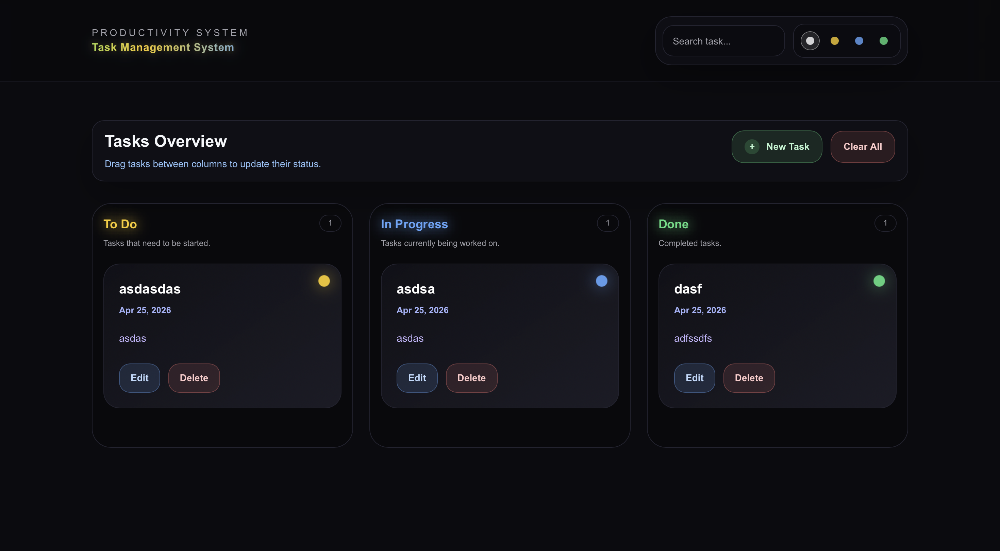

# 🚀 Task Management System

A modern, animated task management system built with Next.js 16, React 19, and Tailwind CSS 4.

Designed with a strong focus on UI/UX, smooth animations, and real-world interaction patterns.

---

## ✨ Features

- 🧠 Smart task management (Create, Edit, Delete)
- 🎯 Status workflow (To Do → In Progress → Done)
- 🔄 Drag & Drop between columns
- 💾 LocalStorage persistence
- 🔍 Live search & filtering
- 🎨 Custom UI system (Mohamed Style 😏)
- ⚡ Smooth iOS-like animations
- 🔔 Animated feedback system (Success / Delete)

---

## 🎨 UI Highlights

- 🌈 Neon gradient heading (multi-color animated)
- 💡 Status-based glowing indicators
- 🧊 Glassmorphism + soft shadows
- 🎬 App-like edit transitions (blur + scale)
- 🔴/🔵 Contextual action buttons (Delete / Edit)
- 🟢/🔴 Animated feedback overlays

---

## 🧱 Tech Stack

- ⚛️ React 19
- ▲ Next.js 16 (App Router)
- 🎨 Tailwind CSS 4
- 🧠 TypeScript

---

## ⚙️ Installation

bash git clone https://github.com/your-username/task-management-system.git cd task-management-system npm install npm run dev 

---

## 🏗️ Build

bash npm run build npm start 

---

## 📸 Preview

  

---

## 🧠 Architecture

- Component-based structure
- Clean separation between UI & logic
- Local state management (no external libs)
- Reusable UI components
- Custom animation system via CSS

---

## 🚧 Future Improvements

- 🔐 Authentication system
- ☁️ Backend (database + API)
- 🧩 Task categories & tags
- 📱 Mobile optimization improvements
- 🌙 Light/Dark mode toggle

---

## 👨‍💻 Author

Mohamed Hadi Dabbah Aljimal™

Built with attention to detail, performance, and design quality.

---

## ⭐ If you like it

Give it a star ⭐ — it means a
